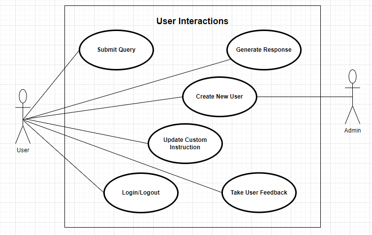
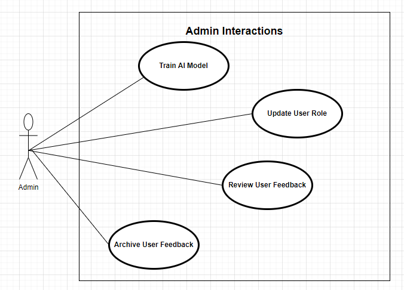
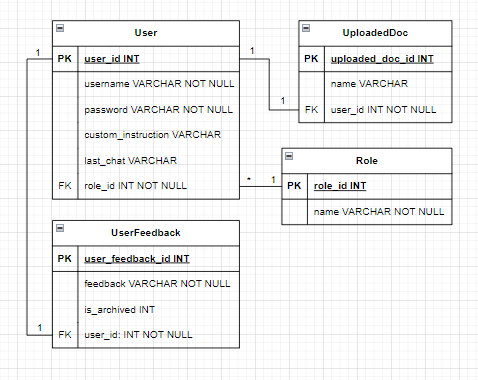

# Software Artifacts

This documents contains links to all the software artifacts relating to this project.

## User Interactions Use Case Diagram

## Admin Interactions Use Case Diagram

## Persistance Layer Class Diagram

## Partial Windows Navigation Diagram

## Class Diagram

## Relational Schema Diagram

